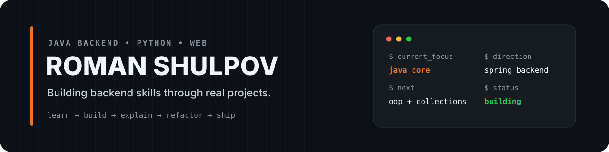

  

## About Me

  <strong>Software Engineering student</strong> focused on <strong>Java backend development</strong>. 
  Building practical projects, learning backend architecture and APIs, and using Python for automation and scripting.

  <code>Java</code>
  <code>Python</code>
  <code>Backend</code>
  <code>Automation</code>
  <code>HTML / CSS</code>

---

## Stack

### Languages

  
  
  
  

### Backend / Learning Next

  
  
  
  
  

### Tools

  
  
  
  

---

## Stats

  

  

---

## Featured Projects

<table>
  <tr>
    <td width="50%" valign="top">
      <a href="https://github.com/Roman-Shulpov/TT-AI-Agent"><strong>TT-AI-Agent</strong></a>
       
      Browser AI agent
        
      
      
      
    </td>
    <td width="50%" valign="top">
      <a href="https://github.com/Roman-Shulpov/bmx_bot"><strong>bmx_bot</strong></a>
       
      Telegram bot
        
      
      
      
    </td>
  </tr>
  <tr>
    <td width="50%" valign="top">
      <strong>ZHELEZOBETON Market</strong>
       
      Commercial web layout
        
      
      
    </td>
    <td width="50%" valign="top">
      <strong>Java Backend Project</strong>
       
      Next portfolio build
        
      
      
      
    </td>
  </tr>
</table>

---

### 🤝 Connect with me:

  
  

