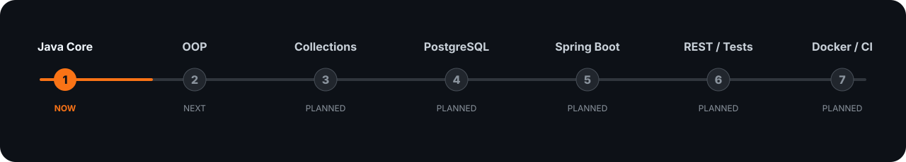

<p align="center">
  
</p>

<p align="center">
  
  
  
</p>

## 👋 About me

🚩 I'm from Russia  
🎓 Software Development student  
☕ Backend direction — **Java first**  
🐍 I also use **Python** for automation and practical projects  
🧠 I prefer learning through real tasks and projects, not just theory  
📈 This profile grows together with my backend roadmap  

---

## ⚙️ Stack

### Working with

[](#)
[](#)
[](#)
[](#)

### On my roadmap

[](#)
[](#)
[](#)
[](#)
[](#)
[](#)

---

## 🧭 Backend roadmap

<p align="center">
  
</p>

<details>
<summary><b>Open detailed roadmap</b></summary>

<br>

`Java Core`
→ `OOP`
→ `Exceptions & Collections`
→ `Files & Git`
→ `SQL / PostgreSQL`
→ `HTTP / REST`
→ `Spring Boot`
→ `JPA / Hibernate`
→ `Testing`
→ `Security`
→ `Docker / CI/CD`

Full checklist: **[ROADMAP.md](./ROADMAP.md)**

</details>

---

## 🚀 Featured project

### Browser AI Agent

**[TT-AI-Agent](https://github.com/Roman-Shulpov/TT-AI-Agent)**

A browser agent that receives a task in natural language and works in visible Chromium.  
The model chooses the next action based on the current page, while Python validates and executes it through Playwright.

**Tech:** `Python` · `Playwright` · `pytest` · `Codex / OpenAI / Ollama`

**What is already there:**
- model-driven browser action loop;
- argument validation;
- confirmation before sensitive actions;
- automated tests;
- support for several model providers;
- recorded demos and test report.

---

## 🧩 Project pipeline

| Stage | Project | Goal |
|---|---|---|
| 01 | `java-core-lab` | Java syntax, methods, arrays, strings |
| 02 | `java-oop-project` | Classes, interfaces, inheritance, structure |
| 03 | `java-collections-project` | Collections, exceptions, equals/hashCode |
| 04 | `java-sql-project` | SQL, PostgreSQL, JDBC |
| 05 | `spring-rest-api` | Spring Boot, REST, validation, JPA |
| 06 | `backend-final-project` | Security, tests, Docker, CI/CD |

> Each new project should be stronger than the previous one.

---

## 📊 Stats

<p align="center">
  
  
</p>

<p align="center">
  
</p>

---

## 🛠 How I learn

```text
understand
   ↓
solve
   ↓
build
   ↓
explain
   ↓
refactor
   ↓
publish
```

I want this GitHub to show not only what technologies I know, but how my projects and code quality improve over time.

<p align="center">
  <sub>Java first • backend focus • projects over buzzwords</sub>
</p>
